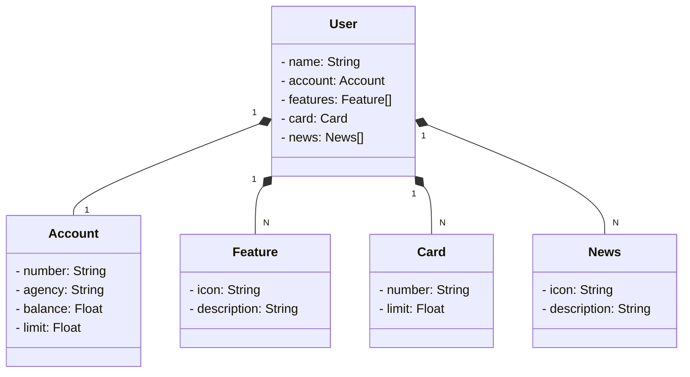

# BootCamp Santander 2023
Java RESTful API - Bootcamp Santander (BackEnd Java)

[Link da API na nuvem](https://bcs-2023-api-prod.up.railway.app/swagger-ui/index.html#/)<br>
Modelo em JSON para insersão de um User
```
{
  "name": "User",
  "account": {
    "number": "110000000-0",
    "agency": "0000",
    "balance": 1999.64,
    "limit": 1000.00
  },
  "card": {
    "number": "xxxx  xxxx xxxx 2000",
    "limit": 1000.00
  },
  "features": [
    {
      "icon": "URL",
      "description": "Descricao da feature"
    }
  ],
  "news": [
    {
      "icon": "URL",
      "description": "Descricao da noticia"
    }
  ]
}
```

## Diagrama de classes


